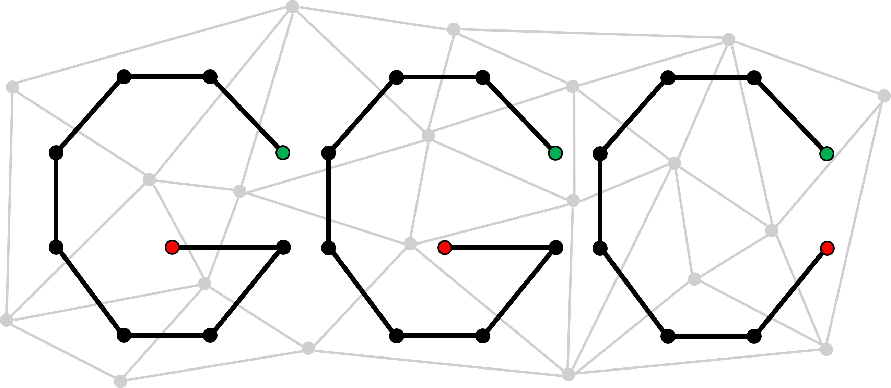

# ggCaller: a bacterial gene caller for pangenome graphs 

ggCaller traverses [Bifrost](https://github.com/pmelsted/bifrost) graphs constructed from bacterial genomes to identify putative gene sequences, known as open reading frames (ORFs). 

ggCaller incorporates [Balrog](https://github.com/salzberg-lab/Balrog) to filter ORFs to improve specificity of calls and [Panaroo](https://github.com/gtonkinhill/panaroo) for pangenome analysis and quality control.

## Documentation

Guides for installation, usage and a tutorial can be found [here](https://ggcaller.readthedocs.io/en/latest/).

## Installation

ggCaller is available on Linux. If you are running Windows 10/11, Linux can be installed via the Windows Subsystem for Linux ([WSL](https://docs.microsoft.com/en-us/windows/wsl/install-win10)).

We plan to get a MacOS version up and running in the future.

NOTE: We are aware of issues installing from conda at the moment. We recommend installing via docker at this time.

### Installing with Docker (recommended)

First, install [Docker](https://docs.docker.com/get-docker/) for your OS. If running with WSL2, you should still download Docker Desktop for Windows.

Then pull the latest image::

    docker pull samhorsfield96/ggcaller:latest

To run ggCaller, run::

	cd test && docker run --rm -it -v $(pwd):/workdir samhorsfield96/ggcaller:latest ggcaller --refs pneumo_CL_group2.txt

### Installation from source
Required packages and versions can be found in ```environment_linux.yml``` and ```environment_macOS.yml``` depending on your operating system. In addition, a C++17 compiler (e.g. gcc >=7.3) is required.

For example, using conda (creates ```ggc_env``` environment)

```
conda env create -f environment_linux.yml
conda activate ggc_env
```

Once all required packages are installed, install ggCaller using:

```
git clone --recursive https://github.com/samhorsfield96/ggCaller
cd ggCaller
python setup.py install
```

### Installation via conda

Install through [bioconda](http://bioconda.github.io/):

```conda install ggcaller```

If conda is not installed, first install [miniconda](https://docs.conda.io/en/latest/miniconda.html), then add the correct channels:

```
conda config --add channels defaults
conda config --add channels bioconda
conda config --add channels conda-forge
```

## Citation

Please cite the ggCaller pre-print:

Horsfield, S.T., Croucher, N.J., Lees, J.A. "Accurate and fast graph-based pangenome annotation and clustering with ggCaller" bioRxiv 2023.01.24.524926 (2023). doi: https://doi.org/10.1101/2023.01.24.524926

If you use this code, please also cite the dependencies:

#### DBG building and querying
- **Bifrost:** Holley, G., Melsted, P. "Bifrost: highly parallel construction and indexing of colored and compacted de Bruijn graphs." Genome Biol 21(249) (2020). https://doi.org/10.1186/s13059-020-02135-8

#### FM-index generation and querying

- **Kseq:** seqtk: https://github.com/lh3/seqtk
- **SDSL v3:** `Succinct Data Structure Library 3.0 <https://github.com/xxsds/sdsl-lite>`_

#### Gene scoring and overlap penalisation

- **Balrog:** Sommer M.J., Salzberg S.L. "Balrog: A universal protein model for prokaryotic gene prediction." PLoS Comput Biol 17(2): e1008727 (2021). https://doi.org/10.1371/journal.pcbi.1008727
- **Eigen v3:** Guennebaud, G., Jacob, B. et al. "Eigen v3" (2010). http://eigen.tuxfamily.org
- **Boost graph library:** Siek, J., Lee, L.Q. & Lumsdaine, A. "Boost graph library" (2002) https://www.boost.org/doc/libs/1_79_0/libs/graph/doc/index.html

#### Pairwise gene comparisons

- **Edlib:** Šošić, M., Šikić, M. "Edlib: a C/C++ library for fast, exact sequence alignment using edit distance." Bioinformatics 33(9) (2017). https://doi.org/10.1093/bioinformatics/btw753

#### Gene annotation

- **DIAMOND:** Buchfink B., Reuter K., Drost H.G. "Sensitive protein alignments at tree-of-life scale using DIAMOND", Nature Methods 18:366–368 (2021). https://doi.org/10.1038/s41592-021-01101-x
- **HMMER3:** Eddy S.R. "A New Generation of Homology Search Tools Based on Probabilistic Inference." Genome Inform., 23:205-211 (2009).

#### Alignment, phylogenetic analysis and variant calling:

- **MAFFT:** Katoh, K., Misawa, K., Kuma, K. & Miyata, T. "MAFFT: a novel method for rapid multiple sequence alignment based on fast Fourier transform." Nucleic Acids Research. 30 (14), 3059–3066 (2002). https://doi.org/10.1093/nar/gkf436
- **SNP-sites:** Page, A.J., Taylor, B., Delaney, A.J., Soares, J., Seemann, T., Keane, J.A. & Harris, S.R. "SNP-sites: rapid efficient extraction of SNPs from multi-FASTA alignments. Microbial genomics." 2 (4), e000056 (2016). https://doi.org/10.1099/mgen.0.000056
- **RapidNJ:** Simonsen, M., Pedersen, C. "Rapid computation of distance estimators from nucleotide and amino acid alignments" Proceedings of the ACM Symposium on Applied Computing (2011) https://doi.org/10.1145/1982185.1982208

#### Clustering and pangenome analysis

- **Panaroo:** Tonkin-Hill, G., MacAlasdair, N., Ruis, C. et al. "Producing polished prokaryotic pangenomes with the Panaroo pipeline." Genome Biol 21(180) (2020). https://doi.org/10.1186/s13059-020-02090-4