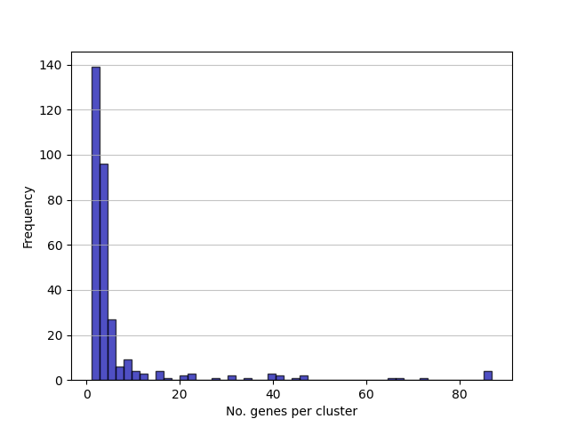
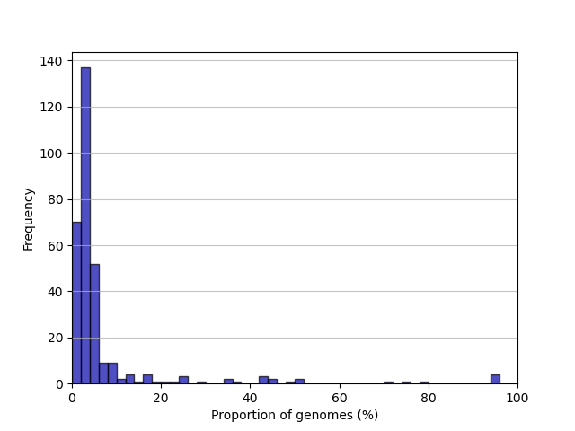
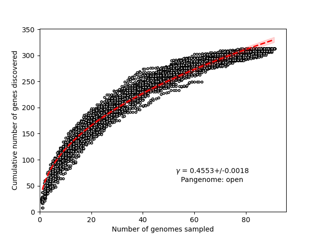

Tutorial
==================================

Here we'll walk through a typical run of ggCaller, including both :ref:`Gene-calling` and :ref:`Querying`.

Installation and setup
----------------------

Follow the guide in :doc:`installation` for downloading and installing ggCaller.

Working Dataset
---------------

We'll use a dataset from `Bentley et al. (2006) <https://journals.plos.org/plosgenetics/article?id=10.1371/journal.pgen.0020031>`_.
This dataset contains 91 sequences pneumococcal capsular polysaccharide synthetic (CPS) loci. These sequences are stucturally diverse,
but are only ~20,000 bp in length, so can be analysed quickly on a standard laptop or desktop.

Download the files from `here <>`_ and unzip::

    tar xvf Bentley_et_al_2006_CPS_sequences.tar.bz2

We will also provide out own custom annotation database for DIAMOND. These will be the manually curated protein sequences
from Bentley et al. Download from `here <>`_ and unzip::

    tar xvf Bentley_et_al_2006_CPS_protein_sequences.tar.bz2

Gene-calling
------------

First generate an input file for ggCaller. This must be a file containing paths (absolute recommended) to all sequences to be analysed.
We recommend running the below command within the unzipped to generate this file::

    cd Bentley_et_al_2006_CPS_sequences
    ls -d -1 $PWD/*.fa > input.txt
    cd ..

`input.txt` will now contain absolute paths to all `.fa` files in the directory `Bentley_et_al_2006_CPS_sequences`

Now we will run ggCaller specifying the below settings:

- Sensitive DIAMOND annotation using a custom database, and HMMER3 using the default database
- Pangenome-wide alignment using default MAFFT
- Saved intermediate datastructures, enabling sequence querying

To do this using 4 threads, run::

    ggcaller --refs fastas/Bentley_et_al_2006_CPS_sequences/input.txt --annotation ultrasensitive --diamonddb Bentley_et_al_2006_CPS_protein_sequences.faa --aligner def --alignment pan --save --out ggc_Bentley_et_al_CPS --threads 4

You will find the following files in the output directory ``ggc_Bentley_et_al_CPS``:

- ``cluster_size.png``: a frequency distribution of clusters by the number of genes found within them

- ``gene_frequency.png``: a frequency distribution of clusters by proportion of dataset

- ``rarefaction_curve.png``: rarefaction curve, describes the number of new genes discovered with random addition of a single genome. Also includes power-law fit for determination of pangenome openness, based on `Tettelin et al. (2005) <https://www.pnas.org/doi/10.1073/pnas.0506758102>`_.

- ``core_gene_alignment.aln``: concatenated core genome alignment
- ``core_alignment_header.embl``: core genome alignment in EMBL format
- ``core_tree_NJ.nwk``: Neighbour joining tree from core genome alignment generated by `RapidNJ <https://birc.au.dk/software/rapidnj/>`_
- ``pangenome_NJ.nwk``: Neighbour joining tree from gene presence/absence matrix generated by `RapidNJ <https://birc.au.dk/software/rapidnj/>`_
- ``pan_genome_reference.fa``: contains centroids for each cluster in FASTA format
- ``gene_calls.faa`` and ``gene_calls.ffn``: gene predictions with annotations in amino-acid and nucleotide FASTA formats
- ``pre_filt_graph.gml`` and ``final_graph.gml``: gene graphs pre- and post-quality control with Panaroo
- ``gene_presence_absence*``: gene presence absence files in three formats; Roary-CSV, CSV and Rtab
- ``struct_presence_absence.Rtab``: structural variant presnce/absence matrix
- ``summary_statistics.txt``: summary of gene frequencies based on Roary
- ``VCF``: directory containing VCF files for each cluster generated by `SNP-SITES <https://github.com/sanger-pathogens/snp-sites>`_
- ``aligned_gene_sequences``: directory of alignment files for each cluster in FASTA format
- ``GFF``: directory of GFF files for each sample in GFF3 format
- ``ggc_data``: intermediate datastructures written to disk, required for :ref:`Querying the graph`.

Querying the graph
------------------